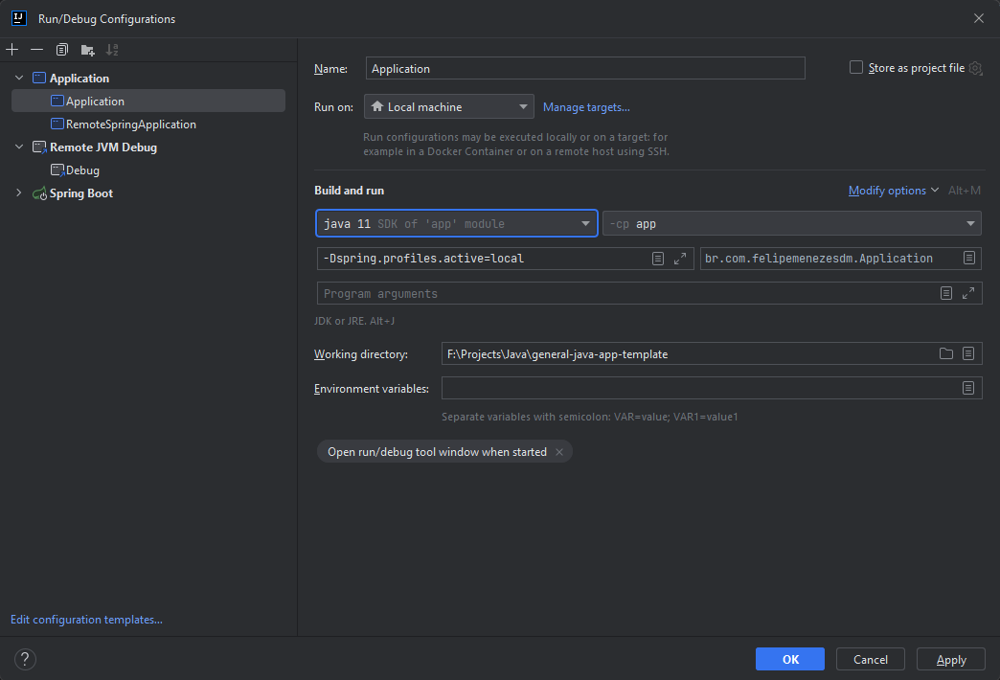
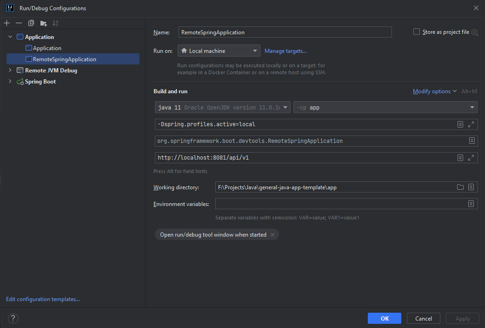
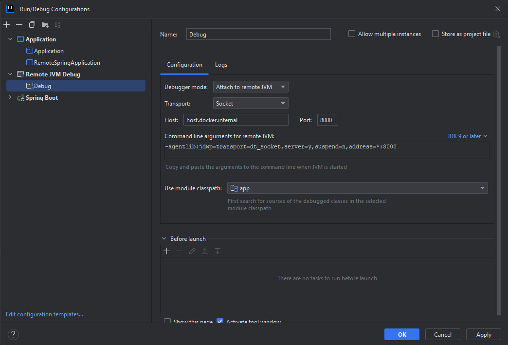

# General Java App Template
## Tópicos
- [Sobre](#sobre)
- [Instalação local](#instalação-local)
  - [Instalação manual](#instalação-manual)
    - [Pré-requisitos](#pré-requisitos)
    - [Passo-a-passo](#passo-a-passo)
  - [Instalação com docker](#instalação-com-docker)
    - [Pré-requisitos](#pré-requisitos-1)
    - [Passo-a-passo](#passo-a-passo-1)
- [Configuração](#configuração)
- [Execução de testes](#execução-de-testes)
  - [Testes unitários e mutantes](#testes-unitários-e-mutantes)
  - [Testes integrados](#testes-integrados)

## Sobre
- [Voltar](#tópicos)
- [Sobre](#sobre)

Template padrão para criação de aplicações Java com Spring Boot.

## Instalação local
- [Voltar](#tópicos)
- [Instalação local](#instalação-local)
  - [Instalação manual](#instalação-manual)
    - [Pré-requisitos](#pré-requisitos)
    - [Passo-a-passo](#passo-a-passo)
  - [Instalação com docker](#instalação-com-docker)
    - [Pré-requisitos](#pré-requisitos-1)
    - [Passo-a-passo](#passo-a-passo-1)
    - [Debug com Docker](#debug-com-docker)

### Instalação manual
#### Pré-requisitos
Para a instalação desta aplicação em ambiente local, é necessário ter instalado em sua máquina os seguintes recursos:
- JDK 11
- Maven 3.8.1
- IntelliJ

#### Passo-a-passo

1. [Baixe e instale o JDK 11](https://www.oracle.com/br/java/technologies/javase/jdk11-archive-downloads.html)
2. [Baixe e instale o IntelliJ](https://www.jetbrains.com/pt-br/idea/download/#section=windows)
3. Clone o projeto com o seguinte comando:
   ```
   git clone https://github.com/FelipeMenezesDM/general-java-app-template.git
   ```
4. Configure a aplicação no IntelliJ:<br>
   
   ```
   # VM Options
   -Dspring.profiles.active=local
   
   # Environment variables
   PORT=8081
   ```
5. Altere os parâmetros da aplicação de acordo com a necessidade
6. Baixe as dependências da aplicação usando os comandos do Maven:
   ```
   mvn clean install -Dmaven.test.skip
   ```
7. Inicie a aplicação, que estará disponível no localhost:<br>
   

### Instalação com docker
#### Pré-requisitos
Para a instalação em ambiente local desta aplicação usando Docker, você deve possuir os seguintes programas instalados em sua máquina:

- Docker
- Docker compose
- IntelliJ

#### Passo-a-passo
1. Clone o projeto usando o comando abaixo:
   ```
   git clone https://github.com/FelipeMenezesDM/general-java-app-template.git
   ```
2. [Baixe e instale a versão mais recente do Docker](https://docs.docker.com/desktop/install/windows-install/)
3. Execute o comando abaixo para baixar as imagens e criar os containers do Docker:
   ```
   PORT=8081 PORT_DEBUG=8000 docker compose up -d
   ```
4. Crie a configuração para do _RemoteSpringApplication_:<br>
   
   ```
   # VM Options
   -Dspring.profiles.active=local
   
   # Environment variables
   PORT=8081
   ```
5. **Em File > Settings > Build, Execution, Deployment > Compiler**, marque a opção "Build project automatically"
6. **Em File > Settings > Advanced Settings > Compiler**, maque a opção "Allow auto-make to start even if developed application is currently running"
7. Inicie o RemoveSpringApplication, **sem o modo debug**:<br>
   
8. Após isso, seu ambiente de desenvolvimento local estará disponível e qualquer alteração feita será refletida automaticamente no container Docker.

#### Debug com Docker
1. Crie a configuração para debug de aplicações remotas no IntelliJ:<br>
   
2. Inicie a configuração de Debug:<br>
   

## Configuração
- [Voltar](#tópicos)
- [Configuração](#configuração)

Por ser uma aplicação Spring Boot, suas configurações podem ser alteradas diretamente no arquivo **application.yml**, localizado no pacote _/app/src/main/resources_.

## Execução de testes
- [Voltar](#tópicos)
- [Execução de testes](#execução-de-testes)
  - [Testes unitários e mutantes](#testes-unitários-e-mutantes)
  - [Testes integrados](#testes-integrados)

### Testes unitários e mutantes
Os testes unitários deste projeto podem ser executados usando diretamente o comando do Maven:
```
mvn clean install
```

Para executar apenas os testes mutantes e gerar o relatório de cobertura, execute o código abaixo:
```
mvn org.pitest:pitest-maven:mutationCoverage
```

### Testes integrados
As informações de execução dos testes integrados desta aplicação podem ser visualizadas diretamente na [documentação do pacotes de testes](./tests/README.md).