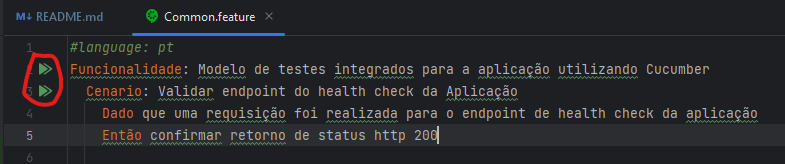
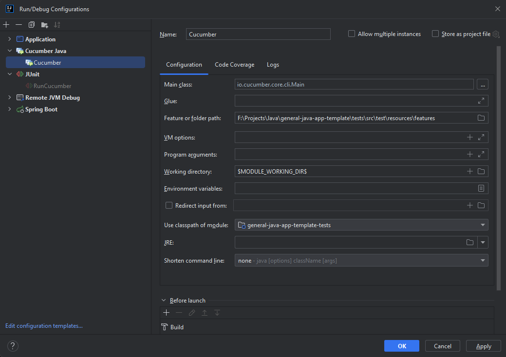

# Testes integrados
Neste pacote estão configurados todos os testes funcionais integrados à aplicação. Eles serão utilizados para validar a integridade da aplicação nos ambientes através de automação.

Este projeto usa Cucumber para implementar e executar todos os cenrários de teste. Após a execução, um relatório é gerado e pode ser usado para criar um histórico de execução dos testes.

Vale ressaltar que, para que os testes seram executados corretamente, é necessário que a aplicação esteja habilitada no ambiente onde os testes estão sendo executados.

[Confira na documentação da aplicação como inicializá-la.](../README.md)

# Execução local
## Execução direta
Para executar todos os cenários de teste, abra o projeto no IntelliJ, clique com o botão direito sobre a classe _RunCucumber_ e, em seguida, na opção "Run". Os testes serão executados integralmente.

É possível também executar os testes individualmente por feature ou por cenário. Para isso, acesse a feature que deseja executar e clique no ícone ao lado do item para execução:<br>


Você também pode executar os testes usando o comando do Maven abaixo:
```
mvn clean install
```

## Execução com o Cucumber for Java
O IntelliJ disponibiliza o plugin Cucumber for Java, que pode ser usado para configurar uma aplicação apartada para execução de testes de forma geral ou individualizada.

1. Para iniciar, instale o Cucumber for Java em **File > Settings > Plugins**.
2. Em **Run > Edit Configurations**, crie uma nova configuração do Cucumber for Java:<br>
   
3. Agora basta executar a configuração, que aceita também o modo debug:<br>
   

# Links úteis
- [Documentação do Cucumber](https://cucumber.io/docs/guides/api-automation/?lang=java)
- [Documentação da aplicação](../README.md)